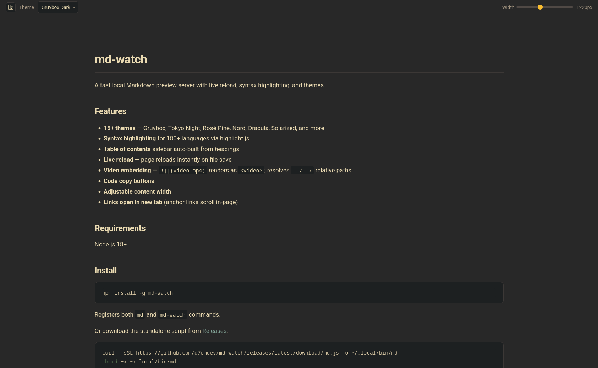

# md-watch

A fast local Markdown preview server with live reload, syntax highlighting, and themes.



## Features

- **15+ themes** — Gruvbox, Tokyo Night, Rosé Pine, Nord, Dracula, Solarized, and more
- **Syntax highlighting** for 180+ languages via highlight.js
- **Table of contents** sidebar auto-built from headings
- **Live reload** — page reloads instantly on file save
- **Video embedding** — `` renders as `<video>`; resolves `../../` relative paths
- **Code copy buttons**
- **Adjustable content width**
- **Links open in new tab** (anchor links scroll in-page)

## Requirements

Node.js 18+

## Install

```sh
npm install -g @d7om/md-watch
```

Registers both `md` and `md-watch` commands.

Or download the standalone script from [Releases](https://github.com/d7omdev/md-watch/releases/latest):

```sh
curl -fsSL https://github.com/d7omdev/md-watch/releases/latest/download/md.js -o ~/.local/bin/md
chmod +x ~/.local/bin/md
```

## Usage

```sh
md <file.md> [port]
md-watch <file.md> [port]
```

Opens a live preview at `http://localhost:8123`. The page auto-reloads whenever the file changes.

```sh
md README.md          # port 8123 (default)
md README.md 3000     # custom port
```

## Build from source

```sh
bun install
bun run build         # outputs dist/md.js
```

## License

MIT © [d7om](mailto:hello@d7om.dev)
